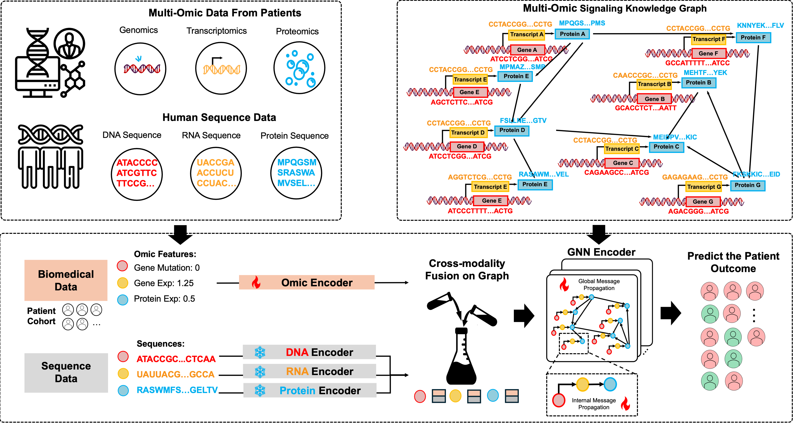

# GraphSeqLM: A Unified Graph Language Framework for Omic Graph Learning



## Environment Setup
```
conda create --name mkg python=3.10

pip3 install torch torchvision torchaudio --index-url https://download.pytorch.org/whl/cu121

pip install torch_geometric

# Optional dependencies:
pip install pyg_lib torch_scatter torch_sparse torch_cluster torch_spline_conv -f https://data.pyg.org/whl/torch-2.2.0+cu121.html

pip install transformers
```

## Preprocess Data
```
cd data

python processed_data_gen.py
```

## Training
```
python main-graphseqlm-gpt.py
```
